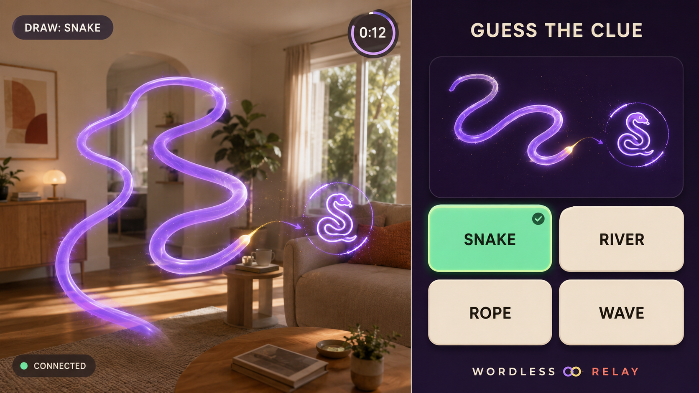

# WORDLESS Relay

One player paints a clue in midair on Spectacles. A friend joins from a
browser, watches the stroke arrive live, and taps the answer that turns the
scribble into a shared session glyph.

> **Current status — approved design and implementation plan.** No Lens Studio
> project, web application, or realtime connection has been implemented yet.
> The plan is awaiting independent adversarial review before Task 1 begins; the
> first build activity remains a hard Lens-to-browser feasibility spike.

## The five-second read

```text
SPECTACLES                              BROWSER
draw a violet clue  ───── realtime ───▶ watch + choose
see the result       ◀── guess event ── tap one of four answers
```

The correct guess freezes the exact path and scales it into a deterministic
glyph medallion visible on both surfaces. It does not use semantic recognition
or generative AI to turn the drawing into an illustrated icon.

## Why this project exists

WORDLESS Relay is the Week 3 **Connect** entry for the CLAD Summer Hackathon.
Its thesis is deliberately small: one spatial action on Spectacles becomes a
live social interaction on an ordinary browser. The browser is a participant,
not a dashboard.

## Build gate

Before game logic or visual polish, a recorded spike must prove that Lens
Studio Preview can send a changing coordinate to a browser and receive a guess
event in return with usable latency. The approved architecture, pass criteria,
fallbacks, and scope are in the
[design specification](docs/superpowers/specs/2026-08-24-wordless-relay-design.md).

## Repository map

- [`AGENTS.md`](AGENTS.md) — non-negotiable build and honesty contract.
- [`docs/superpowers/specs/2026-08-24-wordless-relay-design.md`](docs/superpowers/specs/2026-08-24-wordless-relay-design.md)
  — approved product and technical design.
- [`docs/superpowers/plans/2026-08-24-wordless-relay-implementation.md`](docs/superpowers/plans/2026-08-24-wordless-relay-implementation.md)
  — agent-native implementation, verification, polish, and submission plan.
- [`docs/research/README.md`](docs/research/README.md) — research authority,
  corrections, competitive evidence, and source links.
- [`docs/references/README.md`](docs/references/README.md) — visual-reference
  ranking, provenance, checksums, and the production visual contract.
- [`docs/prompts/visual-reference-prompt.md`](docs/prompts/visual-reference-prompt.md)
  — the prompt used to create the three reference images.
- [`docs/prompts/fable-implementation-plan-review.md`](docs/prompts/fable-implementation-plan-review.md)
  — copy-ready adversarial review prompt.
- [`docs/prompts/implementation-session-kickoff.md`](docs/prompts/implementation-session-kickoff.md)
  — copy-ready fresh-session execution prompt after reconciliation.
- [`docs/prompt-log.md`](docs/prompt-log.md) — annotated planning and build log.

## Visual north star



This image and the two alternates are external AI-generated **design
references only**. They are not runtime assets and must not be imported into
the Lens, web application, demo video, or submission graphics. Production
visuals will be recreated from deterministic, original primitives.
