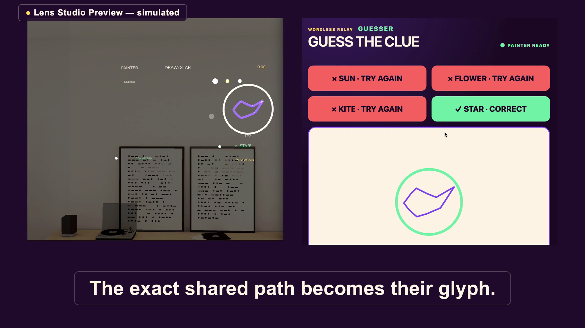

# WORDLESS Relay

<!-- hero extracted from the reviewed candidate; timestamp+hash recorded in docs/submission/video-edl.md -->


One player paints a clue in midair — in **Lens Studio Preview, simulated,
never hardware footage** — while a friend in an ordinary browser watches the
same stroke arrive live, taps one of four answers, and the correct guess locks
the exact drawn path into a glyph medallion both sides keep.

That is the Connect payoff: one spatial action becomes a live social moment
for someone with nothing but a browser tab. The browser submits guesses, never
verdicts — the Lens validates every answer and publishes each result.

**Play it now (hosted guesser):** <https://wordless-relay-connect.vercel.app>
— open Lens Studio Preview to be the painter, read the `ROOM · ABC123` code
from the HUD, and enter it in the hosted page (a `?room=` link prefills the
form; joining is always an explicit click). The page is a static build of
`web/` on Vercel's free tier; the relay is ordinary hosted Supabase Realtime.

**Demo video (59 s):**
<https://drive.google.com/file/d/1uVv-LNj2woNxk6wxGAoXBcy9566Hox6A/view?usp=sharing>
— the video shows the earlier frozen three-color runtime; the current runtime
adds the eight-color palette, generated room codes, protocol v3, and the
hosted browser — see `docs/evidence/hosted-browser.md` for its live proof.

## Current status

- Gate 0 (Lens↔browser realtime spike) is **GO** and Gate 1 (integrated
  vertical slice) is **PASS**; the evidence table below links both records.
- Product scope and the runtime are **frozen**. The 59-second demo candidate is
  captured, assembled, narrated, and technically verified; its captions pass the
  legibility gates and the spoken narration is **owner-signed-off**. Overall
  status: **CANDIDATE ASSEMBLED WITH KNOWN RESILIENCE GAPS** — the one remaining
  non-complete item is Task 15 resilience (PARTIAL: two soak sub-cases are
  unit/policy-proven, not single-run live).
- The five-second comprehension gate is **OWNER-WAIVED — NOT PASSING**. No
  five-second comprehension pass is claimed anywhere in this project.
- The owner authorized publication for the hackathon submission on
  2026-08-30. A post-freeze iteration (owner-approved amendment
  `docs/superpowers/specs/2026-08-30-wordless-rainbow-room-vercel-amendment.md`)
  added the eight-color palette, protocol v3, per-Preview generated room
  codes, and the hosted browser at
  <https://wordless-relay-connect.vercel.app> with a passing hosted latency
  gate (`docs/evidence/hosted-browser.md`). The 59-second demo video remains
  bound to the earlier frozen runtime; a recut for the new runtime is not yet
  captured, so the video and the current code differ in palette and join
  flow, as recorded in `docs/prompt-log.md`.

## What actually happens in a round

The painter draws **one continuous stroke** during a 20-second round while the
browser watches it arrive and submits a guess from four word cards. The Lens is
the only authority: it applies rounds, validates guesses, and publishes
results. A wrong guess turns both strokes coral; the correct guess reveals the
word in mint and freezes the **exact sampled path** — normalized, never
recognized or redrawn — into a shared medallion, then replay starts a clean
successor round.

Everything crosses one ordinary hosted Supabase Realtime public Broadcast
channel as versioned protocol-v2 messages: sequence-numbered, validated before
any state change, and bounded — at most 128 points per stroke, quantized
integer pairs in [0, 1000], at most 8 points per batch, at least 100 ms
between point-batch sends, and no message over 1024 bytes. The painter palette
is violet, lemon, and mint; coral is reserved for wrong-answer feedback.

## Proof

| Proof | Result and key numbers | Evidence |
| --- | --- | --- |
| Gate 0 — realtime spike | **GO** (2026-08-26). 50/50 correlated round trips; RTT median 86 ms, p95 106 ms, max 111 ms; largest valid message 122 bytes; 11/11 malformed payloads rejected. Both clients ran on one machine (Lens Studio Preview + local Chrome), so the latency numbers carry only that one-machine scope. | [docs/evidence/realtime-spike.md](docs/evidence/realtime-spike.md) |
| Gate 1 — integrated vertical slice | **PASS** (2026-08-27). One uncut two-surface recording shows all seven product beats; wire, Lens, and observer records agree on causality and the exact-path glyph hash. | [docs/evidence/vertical-slice.md](docs/evidence/vertical-slice.md) |
| Frozen automated suite | 453 automated tests at freeze: 304 core + 109 web unit + 40 Playwright E2E (two Chromium projects); 55-module production build; clean Lens typecheck. | [docs/prompt-log.md](docs/prompt-log.md) |
| Accessibility | 0 violations in the automated Axe scan (`@axe-core/playwright`, Chromium). | [docs/evidence/layperson-read.md](docs/evidence/layperson-read.md) |
| Visual craft review | **PASS** (Task 13) against bright and medium simulated rooms. | [docs/evidence/visual-review.md](docs/evidence/visual-review.md) |
| Five-second comprehension | **OWNER-WAIVED — NOT PASSING.** The gate was closed by explicit owner waiver, not passed; the verbatim reviewer responses are retained. | [docs/evidence/layperson-read.md](docs/evidence/layperson-read.md) |

Every Lens-side capture in this repository is simulated Lens Studio Preview
behavior. None of it is Spectacles hardware footage or a device test.

## Setup

Prerequisites: Lens Studio 5.23, Node.js with npm, and your own Supabase
project (free tier works) with Realtime enabled and the
`Allow public access to channels` setting on.

1. Open `WordlessRelay.esproj` at the repository root in Lens Studio 5.23
   (Spectacles target).
2. Configure credentials — none are committed, and none should be printed:
   - Browser: copy `web/.env.example` to the ignored `web/.env.local` and fill
     `VITE_SUPABASE_URL` and `VITE_SUPABASE_PUBLIC_KEY`.
     `VITE_RELAY_SESSION_ID` is an optional development-only join-form
     prefill; production builds leave it unset.
   - Lens: create the ignored Supabase project asset under `Assets/LocalOnly/`
     pointing at the same project.
   - No session code is configured anywhere: each Lens Preview run generates
     a fresh six-character room code and shows it as the `ROOM · ABC123` HUD
     line. Type that code into the browser join form (a `?room=` link
     prefills it without auto-joining).
3. Install dependencies: `npm install && npm --prefix web install`.

## Local demo

1. Press play on Lens Studio Preview and read the generated room code from
   the `ROOM · ABC123` HUD line.
2. Start the browser client: `npm --prefix web run dev`, open the printed
   local URL, enter the displayed room code, and press JOIN ROUND. The Lens
   applies a round, both clients subscribe, and the browser flips from
   waiting to four answer cards.
3. Draw one stroke in Preview; watch it arrive live in the browser. Tap a
   wrong card for the coral response, the right card for the mint reveal and
   the locked glyph, then use `PLAY AGAIN` in Preview to replay.

Run the checks:

```sh
npm run check                      # core tests, web unit tests, production build
npm --prefix web run test:e2e      # Playwright E2E (both Chromium projects)
sh tools/typecheck/check.sh        # Lens-side TypeScript preflight
```

## Limitations and security posture

- **Simulated Preview only.** The painter is a Lens Studio Preview client.
  Nothing here is hardware capture, a device test, or a Spectacles field
  claim.
- **Two participants, one machine.** The proof is one painter and one browser
  guesser, measured on a single machine. No claim is made about remote or
  different-network play, more players, or scale.
- **Game concealment, not cryptographic privacy.** The correct answer stays
  Lens-local until the result is published, but the transport is a public
  Supabase Realtime Broadcast channel with no user accounts. This is a public
  Broadcast demo, not production-secure.
- **Nothing persists.** Rounds live in memory; closing a client ends them. No
  gallery, account, or durable storage exists.
- **Bounded latency claim.** The RTT numbers above describe only the recorded
  one-machine Gate 0 measurement — not platform latency, uptime, or
  availability.
- **The glyph is the drawing.** The medallion is the exact sampled path,
  normalized. The runtime contains no camera, microphone, recognition,
  semantic classification, or generative AI.

## Documentation

- [AGENTS.md](AGENTS.md) — the project's build and honesty contract.
- [docs/evidence/claim-ledger.md](docs/evidence/claim-ledger.md) — every
  public claim bound to its evidence.
- [docs/evidence/resilience.md](docs/evidence/resilience.md) — adversarial,
  soak, and recovery evidence.
- [docs/submission/project-description.md](docs/submission/project-description.md)
  — the submission description.
- [docs/submission/video-edl.md](docs/submission/video-edl.md) — the 59-second
  video edit decision list, hero-frame timestamp, and candidate hashes.
- [docs/submission/demo-runbook.md](docs/submission/demo-runbook.md) — the
  live demo runbook.
- [docs/superpowers/specs/2026-08-24-wordless-relay-design.md](docs/superpowers/specs/2026-08-24-wordless-relay-design.md)
  — approved design, with the
  [standard-Supabase](docs/superpowers/specs/2026-08-25-wordless-relay-standard-supabase-amendment.md)
  and
  [submission-review](docs/superpowers/specs/2026-08-29-wordless-submission-review-amendment.md)
  amendments.
- [docs/superpowers/plans/2026-08-24-wordless-relay-implementation.md](docs/superpowers/plans/2026-08-24-wordless-relay-implementation.md)
  — the implementation and verification plan.
- [docs/research/README.md](docs/research/README.md) — research index and
  corrections.
- [docs/references/README.md](docs/references/README.md) — external visual
  reference provenance and the explicit non-use decision.
- [docs/prompt-log.md](docs/prompt-log.md) — the full annotated build log.
